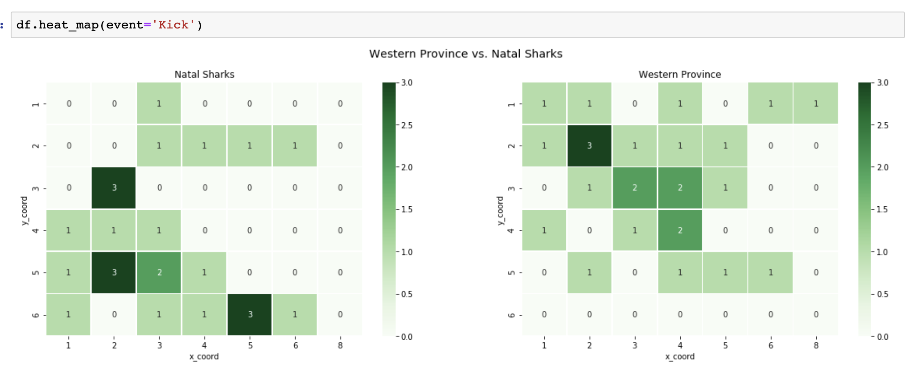

# Pyrugga


Pyrugga is a library to help analyse rugby matches using Opta's Super Scout files. To learn more have a look at [Getting Started](https://github.com/jlondal/pyrugga/blob/master/jupyter/tuts/Getting%20Started.ipynb) notebook.

## Why use Pyrugga

* Converts XML Super Scout files to three Pandas Dataframes providing: a summary of a match, a time line and list of all actions

* Heatmaps



* Player Summary


* Produces

This library requires Super Scout files from [Opta](https://www.youtube.com/watch?v=AVmqCoF5qeU) which can be download via [Prorugby](https://optaprorugby.com). You will have pay Opta for a license.

## Install

```bash
pip install pyrugga
```

For the development version

```bash
!pip install --upgrade --force-reinstal --no-deps git+https://github.com/jlondal/pyrugga.git
```

## Quick Start

```python
import pyrugga as prg

df = pgr.Match('918053_walvfra_new.xml')

#print summary of match
df.summary

#list all actions in a matches
df.events

#time line of a match
df.timeline
```


## License

See [LICENSE](LICENSE)
