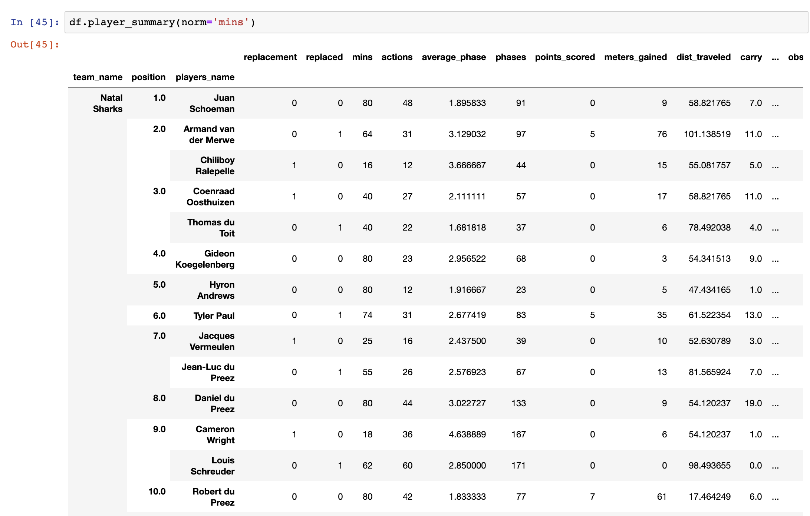

# Pyrugga


Pyrugga is a library to help analyse rugby matches using [Opta's](https://www.youtube.com/watch?v=AVmqCoF5qeU) Super Scout files. To learn more have a look at [Getting Started](https://github.com/jlondal/pyrugga/blob/master/jupyter/tuts/Getting%20Started.ipynb) notebook.

## Why use Pyrugga

* Converts XML Super Scout files to three Pandas Dataframes providing: a summary of a match, a time line and list of all actions

* Heatmaps


* Player Summary



## Install

### I am new to all of this

The easest route is to use [Docker](https://docs.docker.com/get-docker/). Download the Pyrugga repo as a [zip file](https://github.com/jlondal/pyrugga/archive/master.zip).Then unzip and open a [terminal](https://www.youtube.com/watch?v=aKRYQsKR46I) window in the folder then type

```bash
docker-compose up 
```

This will launch a juypter server which you can access via [http://127.0.0.1:8080/tree](http://127.0.0.1:8080/tree). If you dont know how to use Juypter read this [tutorial](https://www.codecademy.com/articles/how-to-use-jupyter-notebooks). 


### I know what I am doing

```bash
pip install pyrugga
```

For the development version

```bash
!pip install --upgrade --force-reinstal --no-deps git+https://github.com/jlondal/pyrugga.git
```

## Quick Start

```python
import pyrugga as prg

df = prg.Match('918053_walvfra_new.xml')

#print summary of match
df.summary

#list all actions in a matches
df.events

#time line of a match
df.timeline

#prints a heatmap
df.heat_map(event='Carry', event_type='One Out Drive', description='Crossed Gainline')

#prints a summary of each players actions normalise by phases while pitch
df.player_summary(norm='phases')

```
## License

See [LICENSE](LICENSE)
